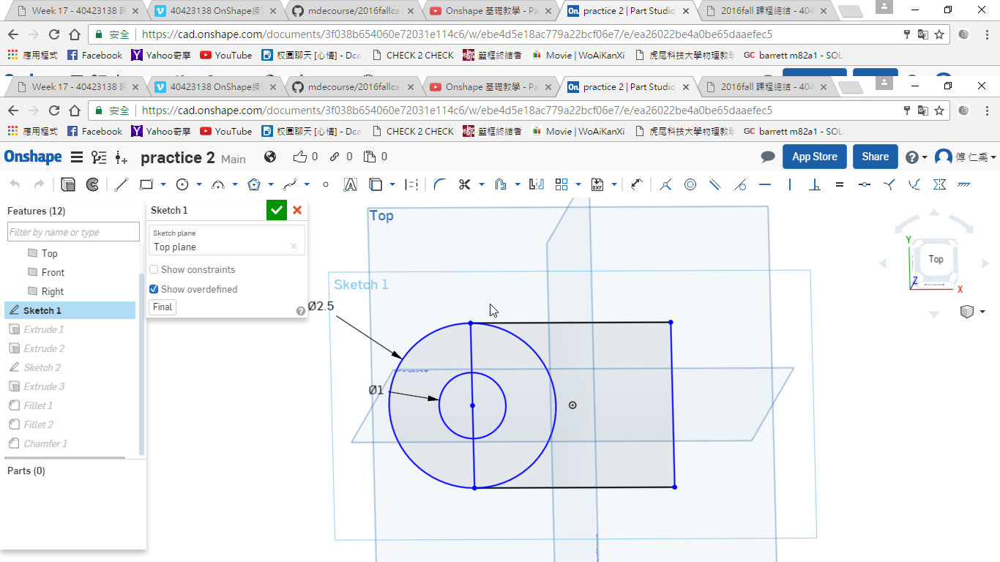
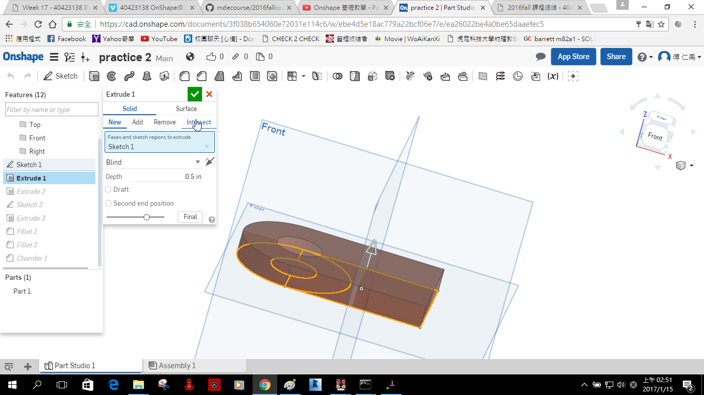
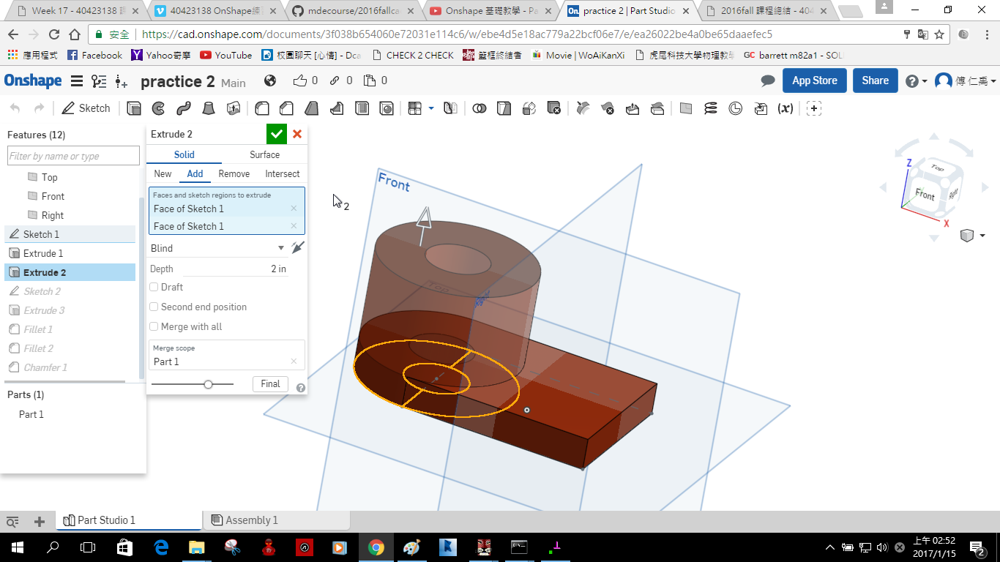
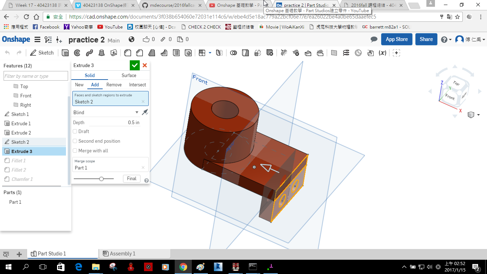

Title: Week 13
Date: 2016-12-08 22:00
Category: Misc
Tags: OnShape(1)
Author: 40423138

上課內容

<!-- PELICAN_END_SUMMARY -->

利用OnShape練習繪製零件。

影片

<iframe src="https://player.vimeo.com/video/199471036" width="640" height="480" frameborder="0" webkitallowfullscreen mozallowfullscreen allowfullscreen></iframe>

<a href="https://vimeo.com/user61521458">個人影片區</a>

心得

今天又教一個新的畫圖軟體OnShape，很像我之前學的繪圖軟體 SolidWorks，不過比較不一樣的地方是它是線上版的，更加的便利了，這可能就是未來的趨勢了。

